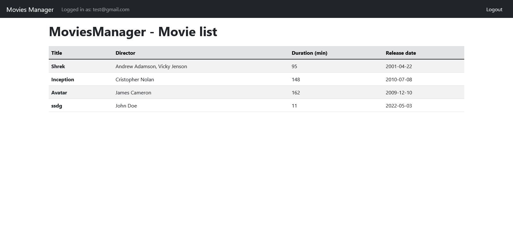
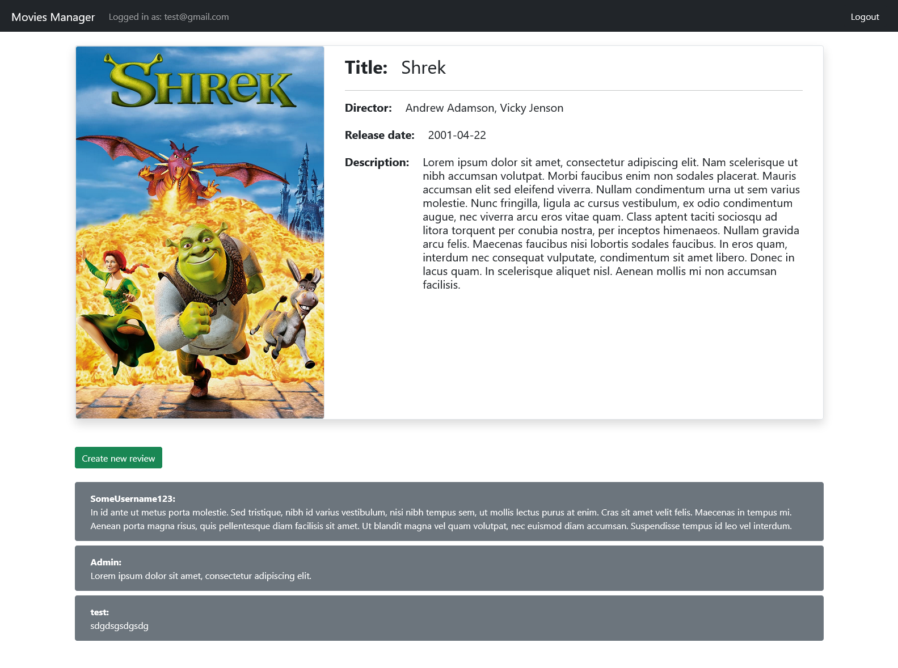
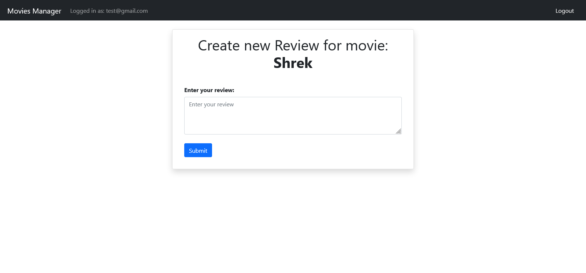
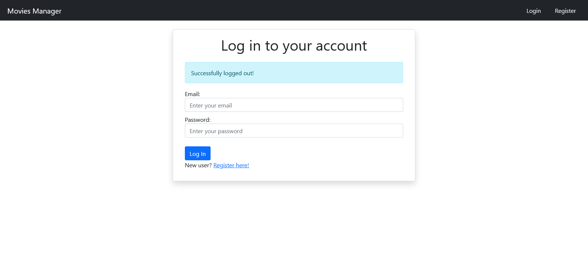
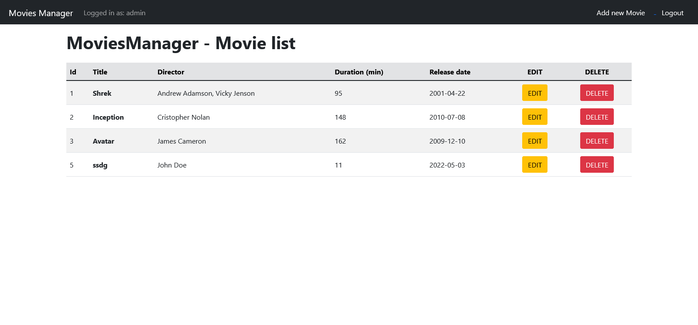
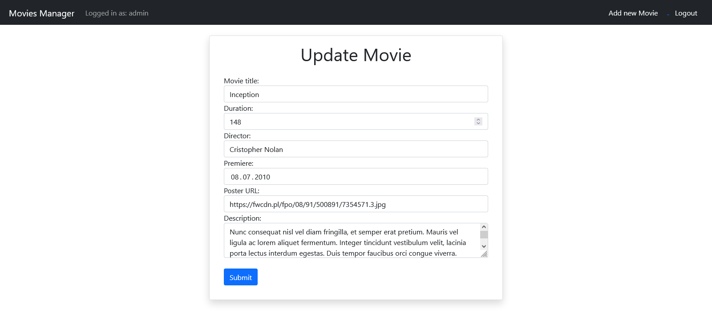

# MoviesManager

My bigger application written using Spring. It is a basic CRUD application for managing movies with addition of user authentication and authorization.
It allows users to browse and leave reviews on various movies. The movies are added by hand because I didnt want to bother with getting them from some API, but this shoult be relatively easy to implement if you need to do so.

## Documentation

Code is set up to work with local MySQL database. To connect it to your own instance change [connection settings](src/main/resources/application.properties#L2)

Also if you dont have table structure for this project I recommend setting [ddl-auto](src/main/resources/application.properties#L6) to create-drop for the first run so that it can create the necessary tables. Then change it back to update so that data is not lost on each restart. 

Additionally for safety purposes there is no way to set admin privileges for user from application itself. To do that you need to go into the *users* table and set *authority* to *ADMIN* for your desired user.

## Screenshots

## Features

- All CRUD options for managing movies
- Account creation with encrypted password
- Role separation, only admins can add and modify movies
- Ability to add reviews to movies

## Technologies

- Java
- Spring
- Hibernate
- MySQL
- Thymeleaf

## Authors

- [@dkrucze](https://github.com/TheKiromen)